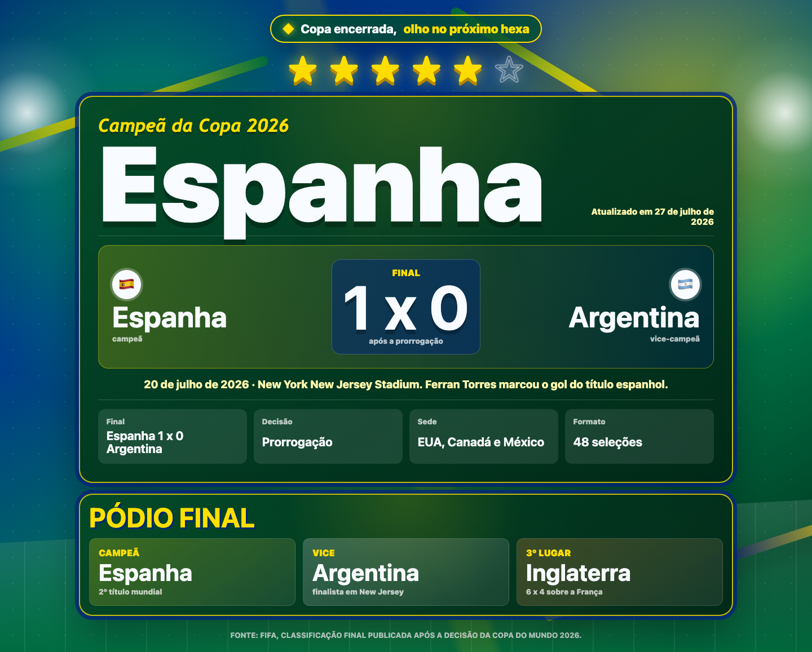
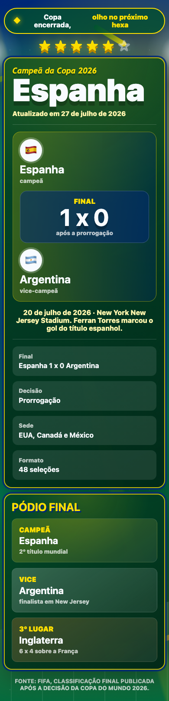

# Horas para a Copa

Um resumo em clima brasileiro do encerramento da Copa do Mundo 2026.

O projeto começou como um contador para a abertura, virou calendário durante o torneio e agora mostra o campeão, placar da final e pódio da Copa 2026, mantendo o visual rumo ao hexa: verde, amarelo, azul, estrelas do penta e uma sexta estrela em contorno.

## Link publicado

[horas-para-copa.vercel.app](https://horas-para-copa.vercel.app)

## Screenshots

### Desktop



### Mobile



## O que tem aqui

- Campeã da Copa 2026 em destaque.
- Placar da final: Espanha 1 x 0 Argentina.
- Informação de que a decisão foi após a prorrogação.
- Pódio final com Espanha, Argentina e Inglaterra.
- Layout responsivo para desktop e celular.
- Design estático e leve, sem backend.

## Resultado final

**Campeã:** Espanha  
**Final:** Espanha 1 x 0 Argentina  
**Detalhe:** vitória após a prorrogação  
**Estádio:** New York New Jersey Stadium  
**Atualizado em:** 27 de julho de 2026

Fonte principal: [FIFA - Final tournament standings](https://www.fifa.com/en/articles/final-tournament-standings)

## Tecnologias

- React
- Vite
- CSS puro
- Vercel

## Como rodar localmente

```bash
npm install
npm run dev
```

Depois abra o endereço exibido no terminal.

## Build de produção

```bash
npm run build
```

O resultado fica na pasta `dist`.

## Estrutura

```text
.
├── index.html
├── package.json
├── docs
│   └── screenshots
│       ├── desktop.png
│       └── mobile.png
├── src
│   ├── main.jsx
│   └── styles.css
└── README.md
```

## Observação

Este é um projeto estático. Para alterar o resumo final ou adicionar mais dados do torneio, edite `src/main.jsx`.
